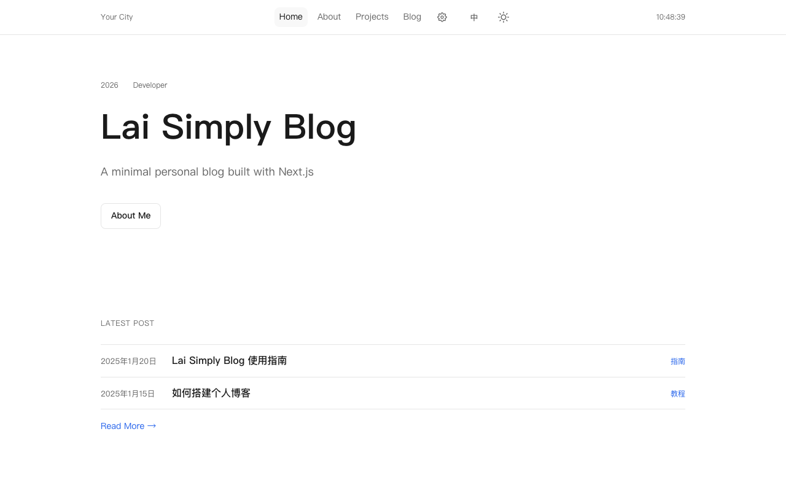
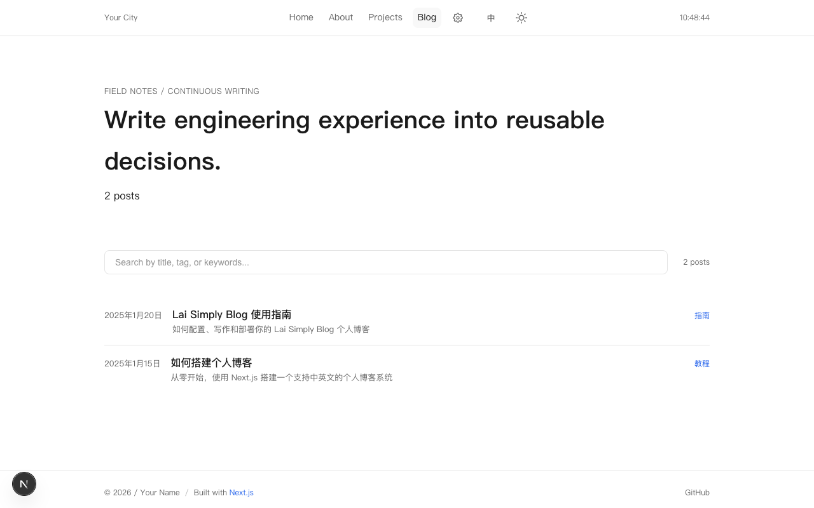
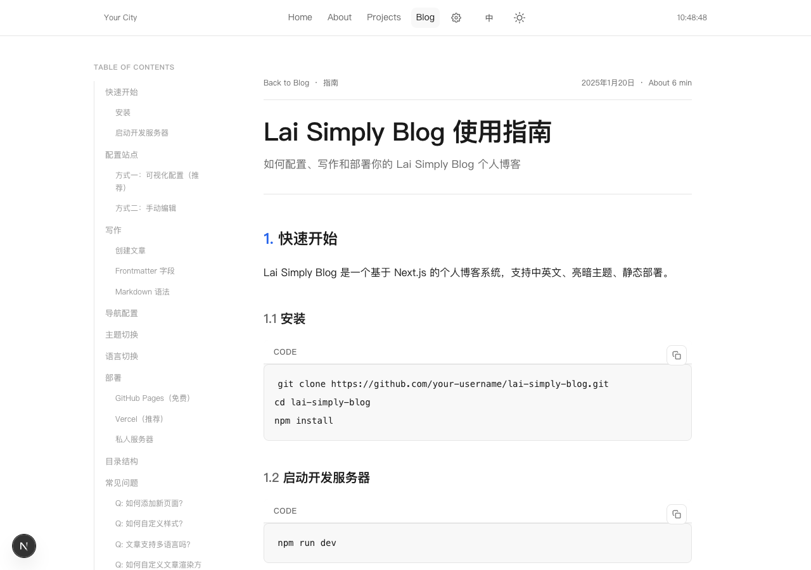
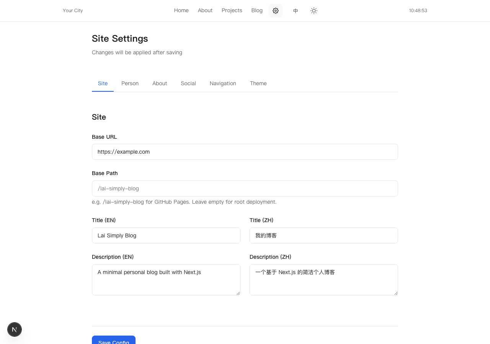

# Lai Simply Blog

> A minimal personal blog system built with Next.js 16.

[中文](./README.md)

## Preview

| Home | Blog List |
|:---:|:---:|
|  |  |

| Article Detail | Settings |
|:---:|:---:|
|  |  |

## Features

- English / Chinese routes, with optional single-language or bilingual content
- Light / Dark theme toggle
- 4 article render styles (Default / GitHub / Notion / Academic)
- Visual settings page (dev mode)
- Code syntax highlighting (Prism.js)
- Responsive design
- Markdown content authoring
- Deploy to GitHub Pages / Private server / Vercel / Docker

## Quick Start

```bash
git clone https://github.com/Chengyunlai/lai-simply-blog.git
cd lai-simply-blog
npm install
npm run dev
```

Visit http://localhost:3001 to see your blog.

The home page uses a GitHub-style layout: a sticky profile panel sits on the left, while recent posts and projects appear on the right. It shows up to 10 recent posts and 5 projects; overflow is available through the “view all” links. The standalone About page has been removed, so the profile is maintained on the home page.

## Configuration

### Option 1: Visual Settings (Recommended)

1. Start dev server: `npm run dev`
2. Click the gear icon ⚙️ in the navigation bar
3. Edit settings and save

### Option 2: Edit Config File

Edit `blog.config.json` in the project root:

```json
{
  "site": {
    "title": {
      "en": "My Blog",
      "zh": "我的博客"
    },
    "baseURL": "https://your-domain.com"
  },
  "person": {
    "name": "Your Name",
    "role": {
      "en": "Developer",
      "zh": "开发者"
    }
  }
}
```

## Writing Posts

Create `.md` files in `content/posts/`:

```markdown
---
title: "Post Title"
summary: "Post summary"
tag: "Category"
publishedAt: "2025-01-20"
---

Your content here...
```

### Frontmatter Fields

| Field | Required | Description |
|-------|----------|-------------|
| `title` | Yes | Post title |
| `summary` | No | Post summary |
| `tag` | No | Category tag |
| `publishedAt` | Yes | Publish date (YYYY-MM-DD) |

The blog index opens directly with search and the post list; it no longer includes a separate promotional hero heading.

## Deployment

### Private Server

```bash
npm run build
npm start
```

Listens on port 3001 by default.

### Docker

```bash
docker build -t lai-simply-blog .
docker run -d -p 3001:3001 --name blog lai-simply-blog
```

### GitHub Pages

1. Fork this repository
2. Enable GitHub Actions in Settings → Pages
3. Push to deploy automatically

> Set `site.basePath` in `blog.config.json` to your repository name (e.g., `/lai-simply-blog`).

### Vercel

1. Visit [vercel.com](https://vercel.com)
2. Import the GitHub repository
3. Auto-deploys with all features

## Tech Stack

| Technology | Purpose |
|------------|---------|
| Next.js 16 | Framework (App Router, Turbopack) |
| React 19 | UI rendering |
| TypeScript | Type safety |
| next-intl | Internationalization |
| Prism.js | Code highlighting |
| remark-gfm | Markdown enhancements (tables, task lists) |

## Project Structure

```
lai-simply-blog/
├── blog.config.json          # Site configuration
├── content/
│   ├── posts/                # Blog posts (.md)
│   └── projects/             # Projects (numbered folders with meta.json)
├── src/
│   ├── app/                  # Page routes
│   │   └── [locale]/         # i18n routing
│   ├── components/           # React components
│   ├── i18n/                 # i18n config
│   ├── messages/             # Translations (en.json, zh.json)
│   ├── resources/            # Styles, config, themes
│   │   ├── themes/           # Article render themes
│   │   └── custom.css        # Global styles
│   └── lib/                  # Utility functions
├── public/
│   └── images/               # Static assets
└── docs/                     # Documentation
```

### Project Content

Projects are ordered by numbered folders. Each folder contains `meta.json` and may include an optional `detail.md` rendered with the blog Markdown renderer:

```text
content/projects/
├── 1/
│   ├── meta.json
│   └── detail.md
├── 2/
│   └── meta.json
└── 3/
    └── meta.json
```

The repository includes three examples under `content/projects/`. `name`, `description`, and `category` may be plain strings, or localized objects with only one language. If one of `en` or `zh` is missing, the available value is used as a fallback.

`meta.json` supports `name`, `description`, optional `category`, `link`, and `image` fields. `image` can be a local path under `public/` or an HTTPS URL. The card is square overall; when an image is provided, its visible area uses a 2:1 landscape ratio. A `1200×600px` image is recommended (`800×400px` minimum). Keep the subject near the center because the page crops images to fit. When two or more categories are present, the Projects page displays category tags and separators.

## Article Themes

4 render styles available, configurable in settings or `blog.config.json`:

| Theme | Description |
|-------|-------------|
| `default` | Clean minimal style |
| `github` | GitHub style |
| `notion` | Notion style |
| `academic` | Academic paper style |

## License

MIT
